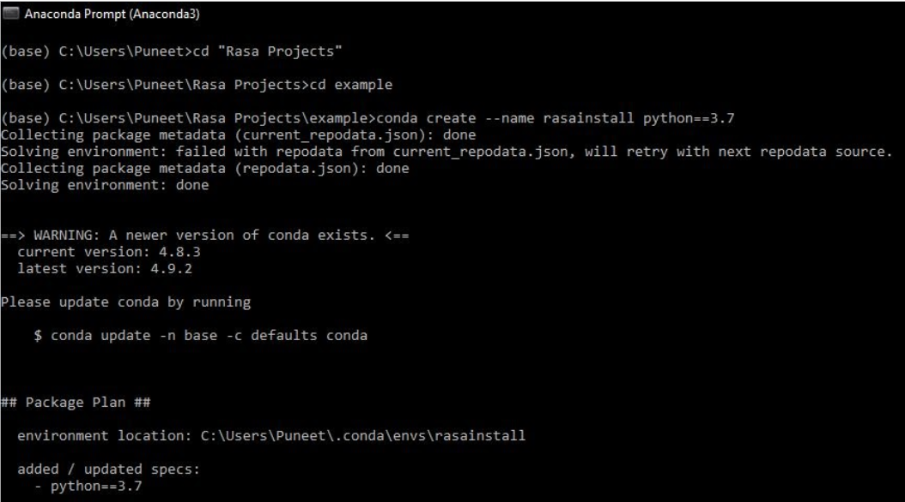
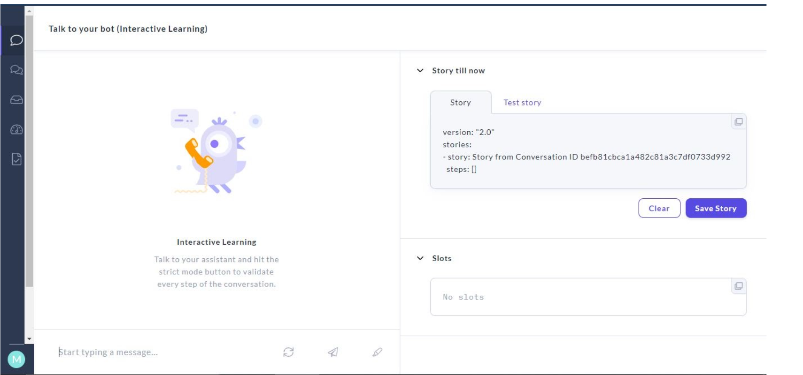

# chatbot
Chatbot during Sabudh Internship

<h1>Chatbot</h1>

A chatbot is a software application using artificial intelligence & natural language processing that provides an on-line chat conversation via text or text-to-speech, in lieu of providing direct contact with a live human agent.

A chatbot can see a lot of applications, be it in messaging applications, healthcare, politics, customer care and many more.

<h2>Prerequisites</h2>
1. Rasa  
2. Rasa x  
3. VS build tools  
4. Tensorflow 
5. ujson 

<h2>Creating a Virtual Environment for Rasa</h2>
1. First create a Virtual environment to set up rasa using the command:- <b>conda create --name <name of env> python==<version of python></b>.  

 

2. Activate the environment using command <b>conda  activate <name of env></b>. After this use the commands <b>pip install ujson</b> and <b>pip install tensorflow</b> to install ujson and tensorflow respectively. 

3. Once done with the first two steps, give the command <b>pip install rasa</b> to install rasa in your environment. 

<h2>Steps followed to make Rasa Chatbot</h2> 

<b>1.</b> Once done with installation of rasa and the other prerequisites, use the command <b>rasa init</b>. This command will create a project with some example training and config files.  
 
The files created by using <b>rasa init</b> are as follows:- 

 

- _**Data(nlu.yml, stories.yml, rules.yml)**_  
_nlu.yml_- The goal of NLU (Natural Language Understanding) is to extract structured information from user messages. This usually includes the user's intent and any entities their message contains.
NLU training data consists of example user utterances categorized by intent. 
_stories.yml_ - Stories are like how you would like the conversation to flow. Different responses you give to the chatbot will have different replies. You are telling the chatbot the various combinations that are possible in the conversation. 
_rules.yml_- Rules are a type of training data used to train your assistant's dialogue management model. Rules describe short pieces of conversations that should always follow the same path.   

- _**domain.yml**_ - The domain defines the universe in which your assistant operates. It specifies the intents, entities, slots, responses, forms, and actions your bot should know about. It also defines a configuration for conversation sessions.

- _**Actions (__init__.py, actions.py)**_- After each user message, the model will predict an action that the assistant should perform next. This page gives you an overview of the different types of actions you can use.

- _**config.yml**_ - The configuration file defines the components and policies that your model will use to make predictions based on user input.

- _**credentials.yml**_ - This file contains the credentials of the voice and chat platforms we are using.

- _**endpoints.yml**_ - This file contains the end points for our bot, the servers from where our bots are pulled.

- _**Tests (test.yml)**_- This file contains the stories those are tested to check the accuracy and precision of the stories formed.

 

**2.** All the files above are updated with intents, entities, actions, stories and domain. After updating the file, the model needs to be trained to update the changes done. The command used for training the model is **rasa train** command. It trains a model using NLU data and stories and saves trained models in ./models.
  
 
**3.** After the model is trained, in order to run it in the shell, use the command **rasa shell**. It loads your model and enables the user to talk on the command line.
   
  

<h3>Rasa x</h3>
Rasa has taken a very innovative and unique approach to continuous improvement of chatbots. This approach they have named Conversation-Driven Development (CDD). The enabler or tool for CDD is called Rasa X. <b>rasa x</b> is a command in rasa command shell which is used after rasa train. 

<h3>Steps followed in rasa x</h3> 
1. After running the rasa x command your terminal redirects you to your browser user interface.  
 
Talk to your bot : This feature provides us an interface as shown above where we can have interactive conversation with our bot after training the model.  Conversations : This feature helps us to check our previous conversations with our bot, which are saved at rasa x.
  NLU Box : This box records our intents on the basis of the conversation we had with our chatbot. It records the intents from the sentences which we used to converse with our bot.
  Models : This feature includes all your trained models. You can select the model which you want, and make it active. 

 
 
2. <b>Integration with telegram</b>- For integrating telegram with rasa, we need to make changes in credentials.yml file, where we need to specify the bot name, access token and the url which directs it to telegram. 
 
3. Use <b>rasa run</b> and <b>rasa run actions</b> command simultaneously to run the chatbot.
  

<h3>Voice Assistance</h3>
Voice assistance can be used where the user can give input to bot using speech and get a response in return as voice or text. It consists of :-
<b>Speech to Text</b> and <b>Text to Speech</b> and <b>voicebot.py</b> modules.  
Once the above modules are made, run the commands given simultaneously to integrate your bot:- <b>conda activate <name of env>,
rasa run -m models --endpoints endpoints.yml --port 5002 --credentials credentials.yml,
rasa run actions</b>

<h2>Approaches followed to make a Chatbot</h2>

1. Rule Based Approach- In a Rule-based approach, a bot answers questions based on some rules on which it is trained on. The rules defined can be very simple to very complex. Thus, a rule based chatbot can solve the problems they are familiar with.
The bots can handle simple queries but fail to manage complex ones.

2. AI Based Approach- Chatbots can use Artificial Intelligence and machine learning to generate their answers. They analyze users’ responses and moods to offer better feedback. These are definitely more efficient than rule-based bots.
The main advantage of AI chatbots is the ability to analyze the collected data.

<h2>Components of Chatbot</h2>

Any chatbot is comprised of some basic components like Intents, Entities and Utterances.  
1. Intents- Within a chatbot, intent refers to the goal the customer has in mind when typing in a question or comment. 

2. Entities- Within a chatbot, an entity, or slot, modifies user intent. Chatbot entities are connected to knowledge repositories in order to provide more personal and accurate responses on user search. 
3. Utterances- Utterances are the input from the user which the chatbot needs to derive intents and entities from. To train any chatbot to accurately extract intents and entities from the user's dialog input, it is imperative to capture a variety of different example utterances for each and every intent.
 
It is very important for a chatbot to give the correct answer as per the user's question. The responses are selected by the chatbot by using the below mechanism:-

<h2>NLP in Chatbot</h2>

The main technology working in the chatbot is **Natural Language Processing (NLP)**. It is the technology that is used by machines to understand, analyse, manipulate, and interpret human's languages. It helps developers to organize knowledge for performing tasks such as _translation, automatic summarization, Named Entity Recognition (NER), speech recognition, relationship extraction, and topic segmentation_.

Any intent classification code can make errors of two types:
1. False positives: the user doesn’t express an intent, but the chatbot identifies an intent.
2. False negatives: the user expresses an intent, but the chatbot doesn’t find it.

NLP can help to handle the above mentioned errors in a simple manner by preprocessing the data of the intent and helps in giving back the responses.

<h3>NLP Pipeline</h3>

The steps followed in text preprocessing using Natural Language Processing are given below:-

 
